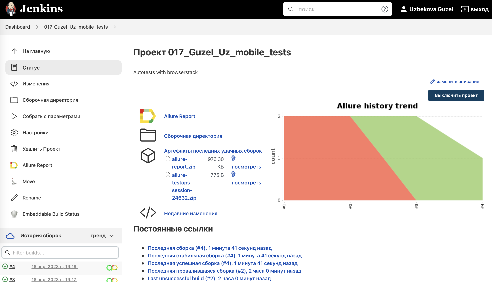
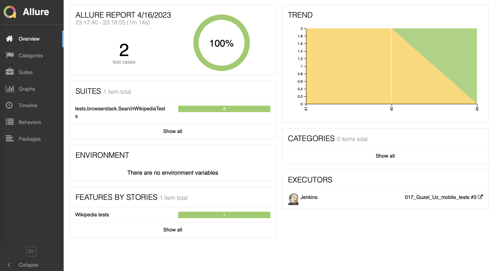
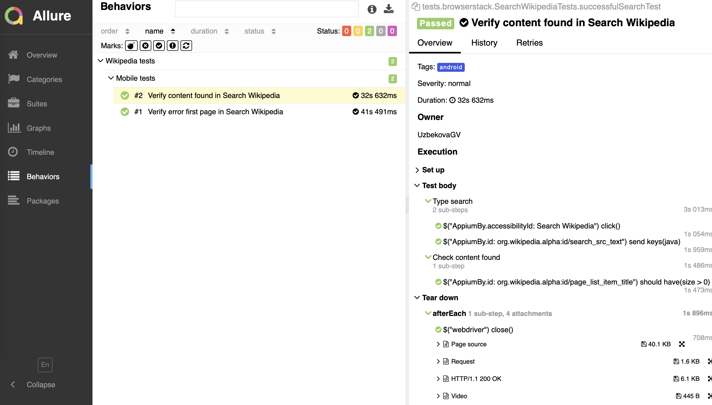
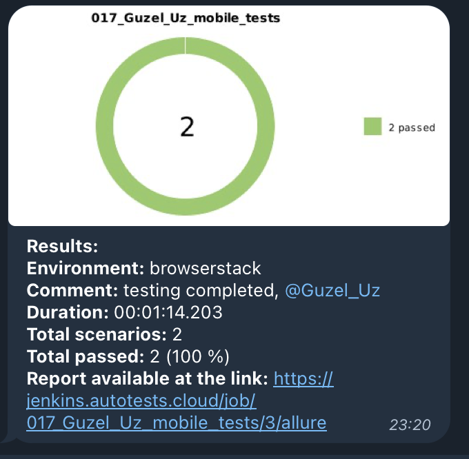
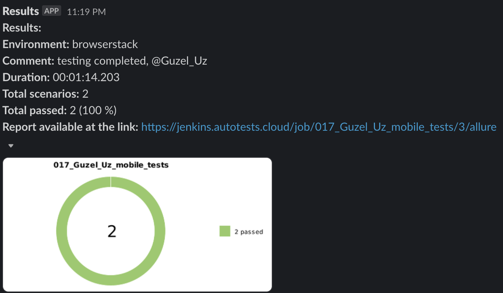
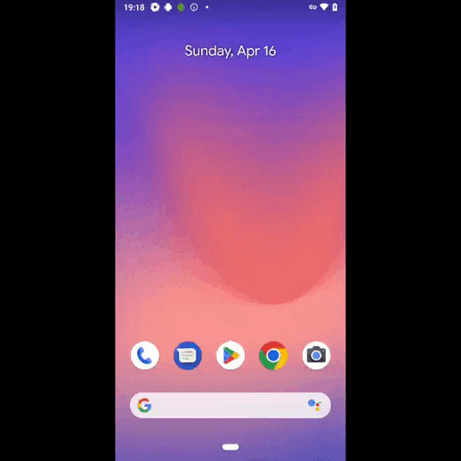

<h1 >Проект автоматизации мобильного тестирования WIKIPEDIA

## Содержание

* <a href="#tools">Технологии и инструменты</a>
* <a href="#cases">Реализованные проверки</a>
* <a href="#console">Запуск тестов</a>
* <a href="#jenkins">Запуск тестов в Jenkins</a>
* <a href="#allure">Отчеты в Allure</a>
* <a href="#testops">Интеграция с Allure TestOps</a>
* <a href="#telegram">Уведомления в Telegram и Slack с использованием бота</a>
* <a href="#video">Видео прохождения тестов</a>

<a id="tools"></a>
## Технологии и инструменты

<div align="center">
<a href="https://www.jetbrains.com/idea/"></a>
<a href="https://github.com/"></a>  
<a href="https://www.java.com/"></a>
<a href="https://gradle.org/"></a>  
<a href="https://junit.org/junit5/"></a>
<a href="https://selenide.org/"></a>
<a href="https://rest-assured.io/"></a>
<a href="https://developer.android.com/studio/"></a>
<a href="https://appium.io/"></a>
<a href="https://https//www.browserstack.com/"></a>
<a href="https://www.jenkins.io/"></a>
<a href="https://github.com/allure-framework/"></a>
<a href="https://qameta.io/"></a>
<a href="https://telegram.org/"></a>
<a href="https://telegram.org/"></a>
</div>

Автотесты написаны на `Java` с использованием `JUnit 5` и `Gradle`.

Краткий список интересных фактов о проекте:
- [x] Реализация автестов с использованием `Browserstack`
- [x] Реализация автестов с использованием `Appium`
- [x] Custom Allure listener для API requests/responses логов
- [x] Cборка в `Jenkins`
- [x] Формирование Allure-отчета
- [x] Интеграция с `Allure TestOps`
- [x] Отправка уведомления с результатами в `Telegram` и `Slack`

<a id="cases"></a>
## Реализованные проверки

### Автоматизированные проверки в Browserstack

:heavy_check_mark: Verify content found in Search Wikipedia

:heavy_check_mark: Verify error first page in Search Wikipedia

:heavy_check_mark: Verify output text in Search Wikipedia

### Автоматизированные проверки в Appium

:heavy_check_mark: Verify primaryTextView in Wikipedia

:heavy_check_mark: Verify skip button

<a id="console"></a>
##  Запуск тестов

### Локальный запуск тестов
```
gradle clean android -DdeviceHost=android 
```
### Удаленный запуск тестов
```
gradle clean android -DdeviceHost=android 
```

<a id="jenkins"></a>
## Запуск тестов в <a target="_blank" href="https://jenkins.autotests.cloud/job/017_Guzel_Uz_mobile_tests/"> Jenkins </a>

<p align="center">

</p>

<a id="allure"></a>
## Отчеты в <a target="_blank" href="https://jenkins.autotests.cloud/job/017_Guzel_Uz_mobile_tests/3/allure/"> Allure report </a>

### Основное окно

<p align="center">

</p>

### Тесты

<p align="center">

</p>

<a id="testops"></a>
## Интеграция с <a target="_blank" href="https://allure.autotests.cloud/project/2185/dashboards"> Allure TestOps </a>

### Доска
<p align="center">

</p>

<a id="telegram"></a>
## Уведомления в Telegram с использованием бота

<p>

</p>

<a id="slack"></a>
## Уведомления в Slack с использованием бота

<p>

</p>

<a id="video"></a>

## Видео прохождения тестов

> К каждому тесту в отчете прилагается видео
<p align="center">
  
</p>